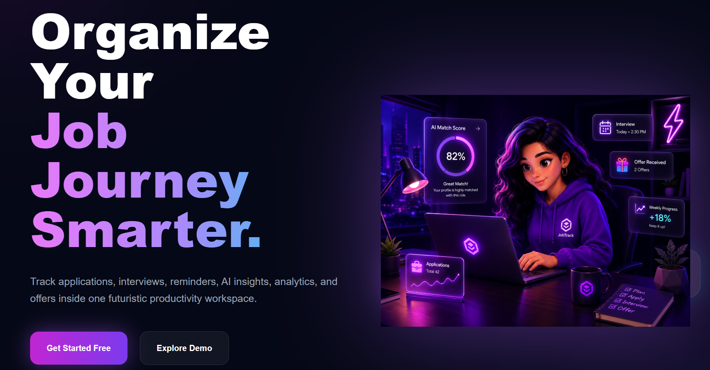
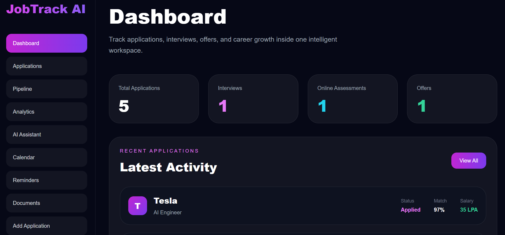
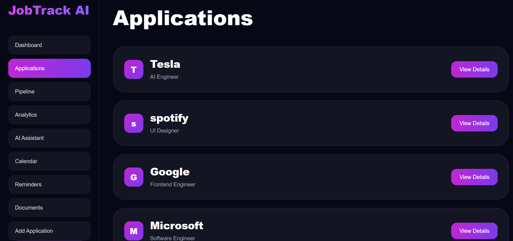
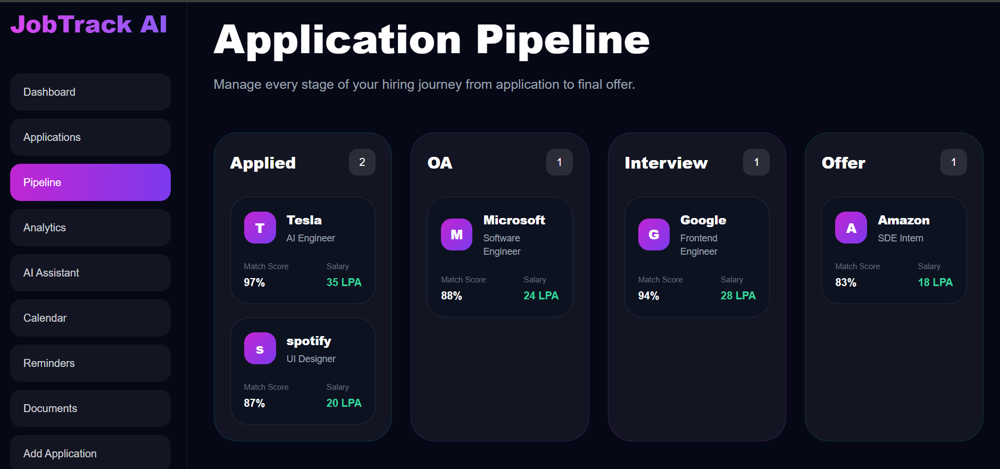
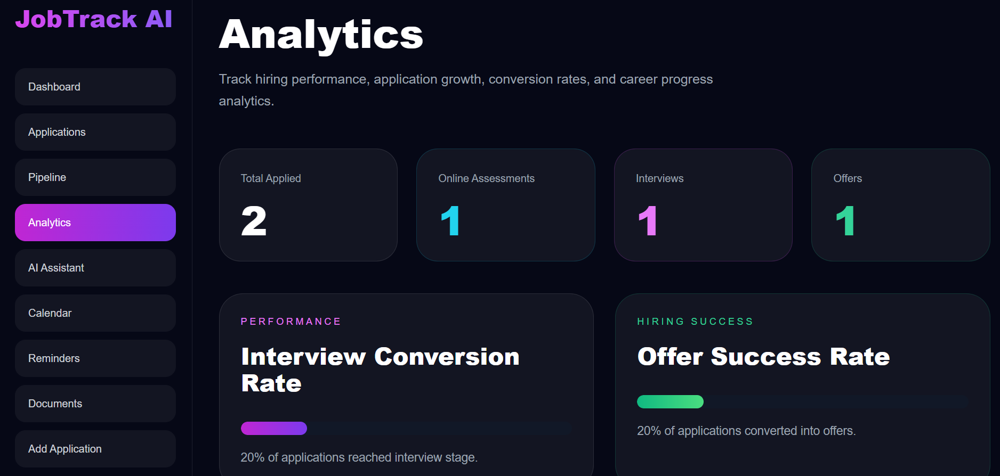
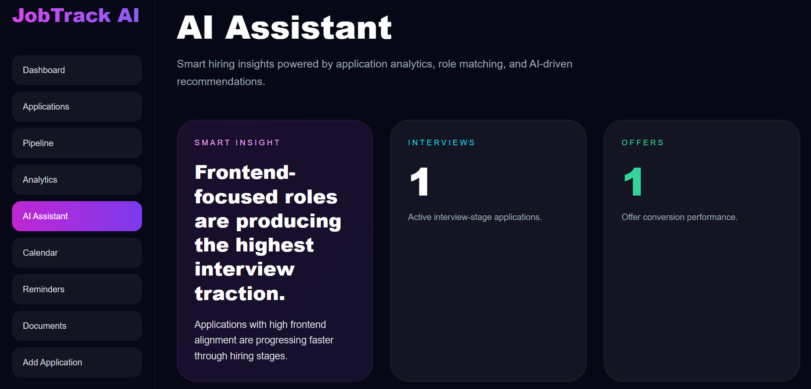
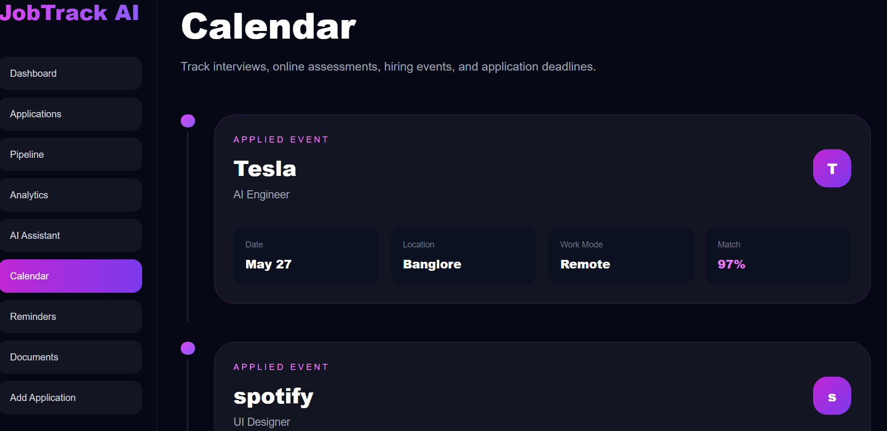
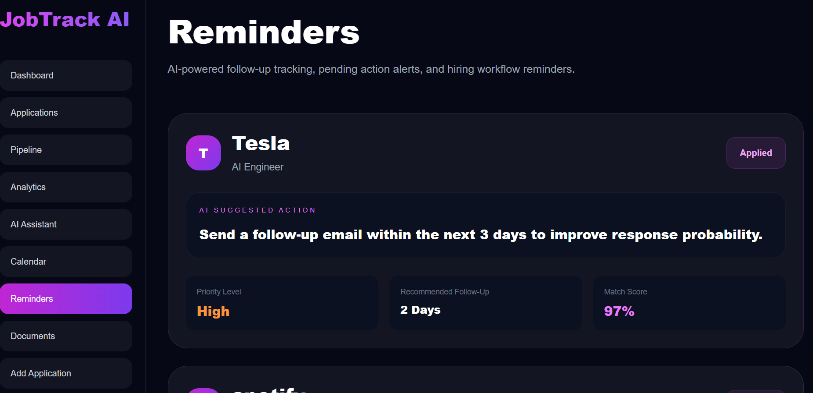
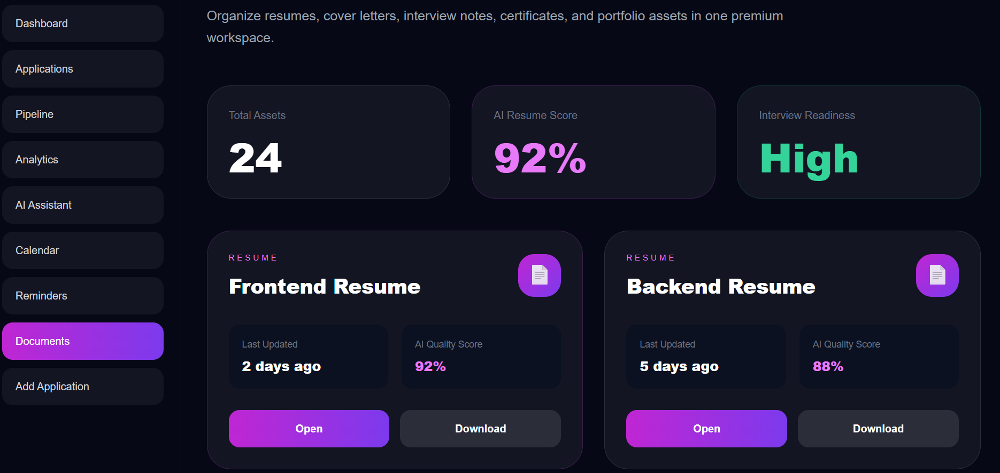
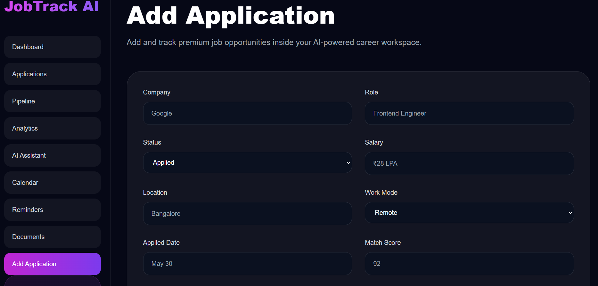

# 🚀 JobTrack AI — Premium AI-Powered Career Management SaaS

Developed by **Shravani Sahare**
👉 **GitHub Portfolio** | **LinkedIn Profile**

[](https://www.mongodb.com/)
[](https://react.dev/)
[](https://tailwindcss.com/)
[](https://nodejs.org/)
[](https://www.mongodb.com/atlas/database)

A futuristic full-stack AI-powered career management platform engineered with the modern **MERN stack** (MongoDB, Express.js, React.js, Node.js). Designed as a premium productivity operating system for students and professionals to track applications, manage hiring workflows, monitor analytics, organize career assets, and streamline the entire job search journey.

---

# 🌌 Landing Experience



---

# 📖 Project Overview

## The Problem It Solves

Managing multiple job applications across LinkedIn, company portals, referrals, and hiring platforms becomes chaotic very quickly. Traditional spreadsheets lack automation, analytics, reminders, workflow visualization, and intelligent tracking.

**JobTrack AI** transforms the job search process into a centralized premium workspace with AI-powered insights, visual analytics, workflow pipelines, reminders, and smart organization systems.

---

# ✨ Key Features & Highlights

* 🚀 Premium futuristic cyberpunk-inspired SaaS UI
* 📊 Real-time analytics dashboard
* 🧠 AI-powered hiring insights
* 📌 Dynamic application workflow tracking
* 📅 Interactive career calendar timeline
* 🔔 Smart reminders & follow-up management
* 📂 Premium document vault for resumes & assets
* ⚡ MongoDB-powered dynamic backend integration
* 🧩 Full CRUD application management
* 🌙 Fully responsive dark-mode experience

---

# 🖼 Feature Showcase

---

## 📊 Dashboard



The dashboard acts as the intelligent control center of the platform, displaying:

* Total applications
* Interviews
* Online assessments
* Offers
* Recent activity tracking
* Smart overview widgets

---

## 💼 Applications Management



Track and manage all applications with:

* Dynamic application cards
* Role information
* Match scores
* Salary tracking
* Company insights
* Application detail pages

---

## 🔥 Application Pipeline



Visual hiring workflow management with:

* Applied stage
* Online assessments
* Interview tracking
* Offer management
* Match scores
* Salary analytics

---

## 📈 Analytics Dashboard



Performance analytics including:

* Interview conversion rates
* Offer success rates
* Hiring performance metrics
* Application growth tracking
* Career progress visualization

---

## 🤖 AI Assistant



AI-powered career intelligence system providing:

* Hiring insights
* Match recommendations
* Smart opportunity analysis
* Career optimization suggestions
* Skill improvement recommendations

---

## 📅 Smart Career Calendar



Track:

* Interview schedules
* Application timelines
* Hiring events
* Assessment dates
* Career milestones

---

## 🔔 AI Reminders System



Automated workflow reminders for:

* Follow-up emails
* Pending applications
* Hiring tasks
* Priority tracking
* AI-generated action recommendations

---

## 📂 Premium Document Vault



Organize:

* Resumes
* Cover letters
* Certificates
* Portfolio links
* Interview notes
* Career assets

---

## ➕ Add Application Workflow



Dynamic MongoDB-powered form system with:

* Company tracking
* Status management
* Match scoring
* Salary tracking
* Work mode selection
* Location tracking

---

# 🛠 Technology Ecosystem

## Frontend Architecture

* **React.js (Vite)** — Lightning-fast frontend architecture
* **Tailwind CSS** — Premium utility-first styling system
* **React Router DOM** — Dynamic routing architecture
* **React Hot Toast** — Beautiful notification system
* **Context API** — Centralized application state management

---

## Backend Infrastructure

* **Node.js** — Backend runtime environment
* **Express.js** — REST API architecture
* **MongoDB Atlas** — Cloud database infrastructure
* **Mongoose** — MongoDB object modeling
* **dotenv** — Environment variable management

---

# 🏗 Project Structure

```text
jobtrack-ai/
│
├── client/
│   ├── src/
│   │   ├── components/
│   │   ├── layouts/
│   │   ├── pages/
│   │   ├── data/
│   │   ├── context/
│   │   └── assets/
│   │
│   ├── public/
│   └── package.json
│
├── server/
│   ├── config/
│   ├── models/
│   ├── routes/
│   ├── controllers/
│   ├── middleware/
│   └── server.js
│
├── screenshots/
├── README.md
└── .gitignore
```

---

# 🗄 Database Features

MongoDB Atlas stores:

* Application records
* Hiring workflow stages
* Match scores
* Salary information
* Career analytics
* Reminder workflows

---

# 🚀 Getting Started

## Step 1 — Clone Repository

```bash
git clone https://github.com/yourusername/jobtrack-ai.git
```

---

## Step 2 — Install Frontend Dependencies

```bash
cd client
npm install
```

---

## Step 3 — Install Backend Dependencies

```bash
cd ../server
npm install
```

---

## Step 4 — Setup Environment Variables

Create `.env` inside `server/`

```env
PORT=5000
MONGO_URI=your_mongodb_connection_string
```

---

## Step 5 — Start Backend

```bash
npm run dev
```

---

## Step 6 — Start Frontend

Open another terminal:

```bash
cd client
npm run dev
```

---

# 💡 Learning Outcomes

This project demonstrates:

* Full-stack MERN development
* REST API integration
* MongoDB Atlas connectivity
* Dynamic React architecture
* SaaS UI/UX design systems
* State management
* Responsive design principles
* Component-driven frontend engineering
* Modern dashboard systems
* Professional project structuring

---

# 🔮 Future Improvements

* Real AI API integration
* Authentication system
* Resume parser
* Email automation
* Drag-and-drop pipeline
* Cloud deployment
* Multi-user collaboration
* Real-time notifications

---

# 👨‍💻 Developer

## Shravani Sahare

Passionate about:

* Full-stack development
* AI-powered systems
* Futuristic SaaS products
* Premium UI engineering
* Smart productivity platforms

---

# ⭐ Final Note

JobTrack AI is designed as a modern premium career operating system focused on intelligent application tracking, workflow optimization, and futuristic user experience engineering.

Built with ❤️ using the MERN Stack.
